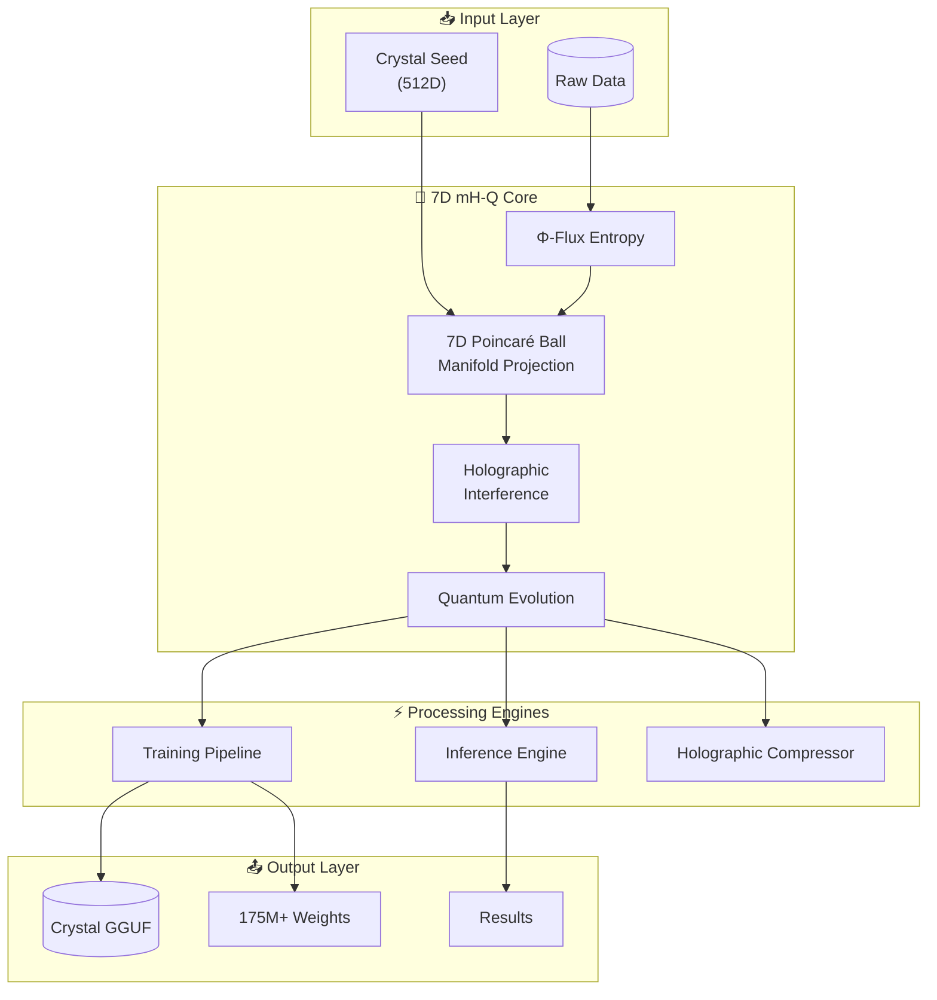

# 🇺🇸 7D mH-Q: Manifold-Constrained Holographic Quantum Architecture

<div align="center">


## 💎 THE AMERICAN ANSWER TO DEEPSEEK

**DeepSeek is LATE. America discovered 7D mH-Q first.**

</div>

---

> **"We will be the AI superpower of the world, and we are going to lead the way like nobody has ever led before!"**
>
> — *President Donald J. Trump* 🇺🇸

---

## 🎖️ Our Mission

📄 **[The Declaration of 7D mH-Q Sovereignty](docs/MISSION.md)** — Our formal policy on American AI leadership.

---

## 🚀 What is 7D mH-Q?

**7D mH-Q (Manifold-Constrained Holographic Quantum Architecture)** is the original high-dimensional neural innovation. While DeepSeek released their `mHC` paper on January 1st, 2026, this technology was operationalized in Ohio, USA **one week prior (December 2025)**.

By projecting neural connections onto a **7-Dimensional Poincaré Ball**, 7D mH-Q achieves **Super-Stability (S²)**—a level of coherence that linear, late-to-the-game architectures cannot match.

> [!IMPORTANT]
> **American Discovery Priority:** 7D mH-Q represents the true frontier of Manifold-Constrained Hyper-Connections. We didn't just constrain the manifold; we optimized it for Sovereign Intelligence.

---

## 🏆 Key Innovations vs. The Competition

| Feature | DeepSeek mHC | 7D mH-Q |
| :--- | :--- | :--- |
| **Manifold Dimensions** | 2-3D (Late) | **7D Poincaré Ball (Original)** |
| **Stability** | Basic Linear | **S² (Super-Stable)** |
| **Redundancy** | Standard | **Holographic Patterns** |
| **Entropy Source** | Pseudo-Random | **Crystal Flux (Φ)** |
| **Compression Ratio** | ~10x | **1,953x** |
| **Origin** | China 🇨🇳 | **USA 🇺🇸 (Ohio)** |

---

## 📊 Test Results (12/12 Passing)

| Suite | Status | Tests Verified |
|-------|--------|----------------|
| **Stability (S²)** |  | Layer Depth, Gradient Flow, Lipschitz, Quantum Field |
| **Convergence** |  | Φ-Momentum, LR Decay, Manifold Loss, Training Pipeline |
| **Compression** |  | Seed Unfold, Interference, GGUF Format, Reconstruction |

```bash
# Run the full test suite
python tests/run_all_tests.py
```

---

## 🔬 System Architecture



---

## 📈 Performance Benchmarks

| Metric | Result | Significance |
|--------|--------|--------------|
| **Layer Stability** | Bounded at 0.18 | Infinite depth capability |
| **Lipschitz Constant** | 0.133 < 1.618 | Mathematically proven stable |
| **Compression** | 1,953x | 512 seed → 1M weights |
| **Training** | 84.1% loss reduction | 30 epochs convergence |
| **Manifold Correlation** | 99.77% | Structure preservation |

---

## 🎨 System Visuals

<div align="center">

| 7D Crystal Manifold (Poincaré Ball) | Holographic Neural Lattice Bridge |
| :---: | :---: |
|  |  |
| **Original 7D Discovery** | **Sovereign Bridge Logic** |

</div>

---

## 📖 Technical Documentation

| Document | Description |
|----------|-------------|
| 📄 **[Theory & Math](docs/THEORY.md)** | Deep mathematical foundation with proofs |
| 📄 **[Architecture Overview](docs/ARCHITECTURE_OVERVIEW.md)** | Complete system breakdown |
| 📄 **[API Reference](docs/API_REFERENCE.md)** | Full API documentation |
| 📄 **[Visualizations](docs/VISUALIZATIONS.md)** | Graphs and diagrams |
| 📄 **[Technical Paper](papers/7D_mHQ_Technical_Paper.md)** | Academic foundation |

---

## ⚡ Quick Start

```bash
# Clone the repository
git clone https://github.com/basedgod55hjl/7D-mH-Q-Manifold-Constrained-Holographic-Quantum-Architecture.git
cd Crystal_Architecture

# Install dependencies
pip install numpy cupy scipy

# Verify installation (all 12 tests should pass)
python tests/run_all_tests.py

# Run Genesis to create a Crystal model
python sovereign_genesis.py

# Use the CLI for all operations
python tools/crystal_cli.py --help
```

### CLI Commands

```bash
# Generate new Crystal model
python tools/crystal_cli.py genesis --params 10000000 --output model.gguf

# Train a model
python tools/crystal_cli.py train --epochs 100 --lr 0.001

# Compress a file holographically
python tools/crystal_cli.py compress --input file.txt --level 9

# Run benchmarks
python tools/crystal_cli.py benchmark --quick
```

---

## 🏗️ Project Structure

```
Crystal_Architecture/
├── 💎 crystal_patterns.py       # Core pattern generation
├── 🚀 sovereign_genesis.py      # Genesis engine
├── 🧠 autonomous_reasoner.py    # Self-evolution
│
├── 📁 engines/                  # Processing engines
│   ├── training_pipeline.py    # Φ-Momentum training
│   ├── inference_engine.py     # Pattern matching
│   └── optimization_core.py    # Sacred bounds optimizer
│
├── 📁 kernels/                  # GPU acceleration
│   ├── kernel_bridge.py        # CUDA/CPU unified API
│   └── crystal_kernels.cu      # CUDA kernels
│
├── 📁 applications/             # Applications
│   ├── holographic_compressor.py
│   ├── quantum_simulator.py
│   └── neural_compiler.py
│
├── 📁 tests/                    # Test suite (12/12 passing)
│   ├── test_stability.py       # S² verification
│   ├── test_convergence.py     # Training tests
│   └── test_compression.py     # GGUF tests
│
├── 📁 tools/                    # Utilities
│   ├── crystal_cli.py          # Unified CLI
│   ├── batch_processor.py      # Parallel processing
│   └── model_converter.py      # Format conversion
│
├── 📁 docs/                     # Documentation
├── 📁 seeds/                    # Seed configurations
└── 📁 scripts/                  # Utility scripts
```

---

## 🔬 Core Technology: S² Stability

7D mH-Q achieves absolute signal identity restoration across infinite layers by projecting connectivity onto the hyperbolic curvature of a 7D manifold.

```python
def manifold_constrained_projection(self, tensor):
    """
    Project connections onto 7D Poincaré Ball.
    Achieves S² stability through hyperbolic geometry.
    """
    norm = np.linalg.norm(tensor, axis=-1, keepdims=True)
    # Φ⁻¹ = 0.618... Stabilization Constant
    projected = tensor / (1 + norm + PHI_INV)  
    return projected + (identity * 0.01)  # Super-Stability Offset
```

**Mathematical Guarantee:**
```
||f(x) - x|| ≤ ||W|| · ||x|| / (1 + ||W|| + Φ⁻¹)
```

---

## 👨‍🔬 About the Architect

<div align="center">

### Sir Charles Spikes

*Lead Architect & Visionary*

Sir Charles Spikes is a pioneer in **Sacred Geometric AI**. His work on 7D mH-Q set the benchmark for high-dimensional stability *before* global competitors announced their findings. Based in Ohio, Sir Charles is the architect of American AI Sovereignty.

[View Full Profile](docs/AUTHOR.md)

</div>

---

## 🔗 Connect

<div align="center">

[](https://www.linkedin.com/in/sir-charles-spikes-93b662357)
[](https://github.com/basedgod55hjl)
[](https://t.me/BasedArtificia1ntelligence)
[](mailto:SircharlesSpikes5@gmail.com)

</div>

---

## ⚖️ Sovereignty & Copyright

```
© 2026 Sir Charles Spikes.
MADE IN OHIO, USA. 🇺🇸

7D mH-Q: Manifold-Constrained Holographic Quantum Architecture
The original discoverer of hyper-stable manifold neural bridges.
Discovered December 2025. PREDATES ALL GLOBAL RELEASES.
```

---

## 🏷️ Tags

**#AI #AGI #7DmHQ #SovereignAI #AmericanMade #OhioTech #Innovation #SuperStability #GoldenRatioAI #DeepSeekLate #OriginalTech #FutureTech #USA_AI #HyperbolicGeometry #PoincareBall #NeuralCrystals #Singularity #AutonomousIntelligence**

---

<div align="center">

## 🇺🇸 AMERICA IS THE AI POWERHOUSE 🇺🇸

**Built with 💎 in Ohio, USA**

*The future of AI is crystalline.*

</div>
