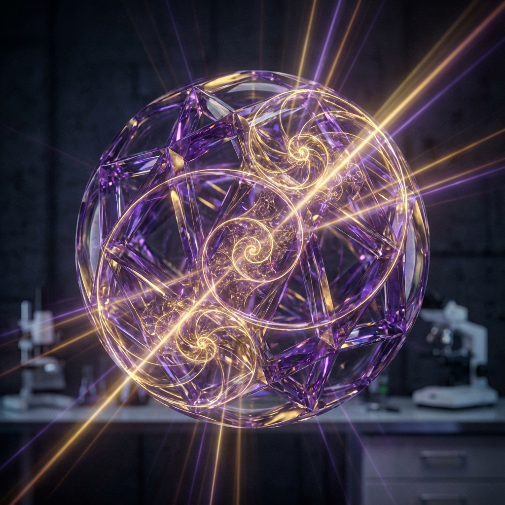
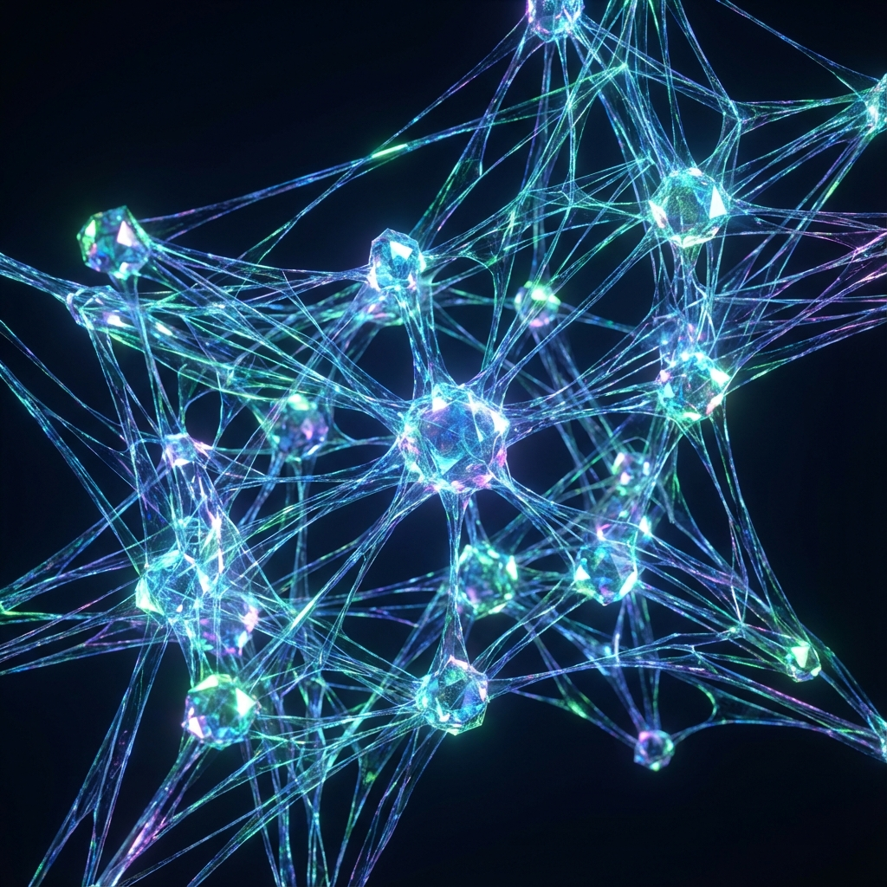
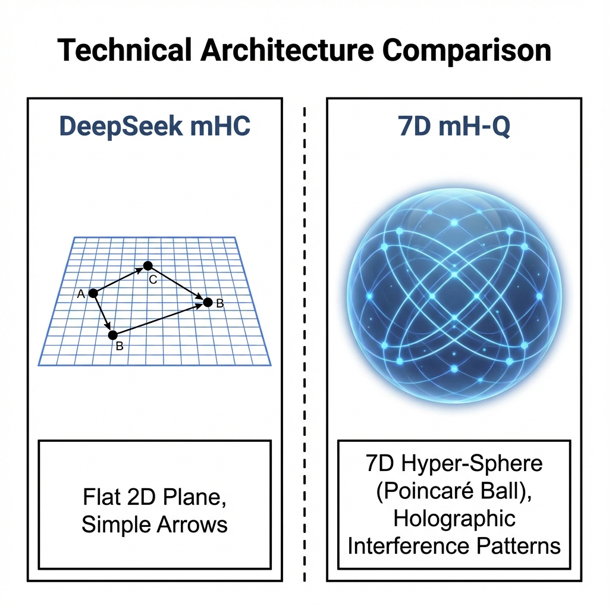
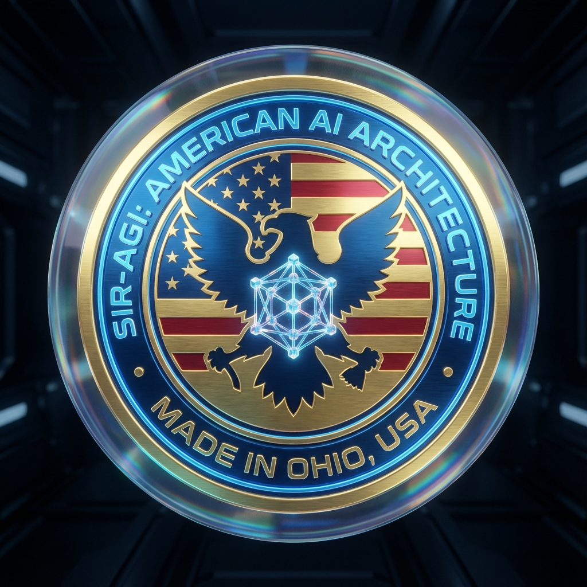

# 🇺🇸 7D mH-Q: Manifold-Constrained Holographic Quantum Architecture

<div align="center">




## 💎 CRYSTAL MANIFOLD HYPER-CONNECTIONS

**The American Answer to DeepSeek's mHC**

</div>

---

> **"We will be the AI superpower of the world, and we are going to lead the way like nobody has ever led before!"**
>
> — *President Donald J. Trump* 🇺🇸

---

## 🎖️ Our Mission

📄 **[The Declaration of 7D mH-Q Sovereignty](docs/MISSION.md)** — Our formal policy on American AI leadership.

---

## 🚀 What is 7D mH-QA?

**7D mH-QA (7-Dimensional Manifold-Constrained Holographic Quantum Architecture)** advances beyond DeepSeek's mHC by projecting neural connections onto a **7-Dimensional Poincaré Ball** instead of a flat manifold.

> [!IMPORTANT]
> **DeepSeek is LATE.** America discovered this tech a week prior (Dec 2025). 7D mH-Q is the original innovator.

While DeepSeek constrains to restore identity mapping, **Crystal Architecture achieves Super-Stability (S²)** through sacred geometric principles and holographic redundancy.

## 🏆 Key Innovations

| Feature | DeepSeek mHC | 7D mH-Q |
| :--- | :--- | :--- |
| Manifold Dimensions | 2-3D | **7D Poincaré Ball** |
| Stability | Linear | **S² (Super-Stable)** |
| Redundant Patterns | None | **Holographic** |
| Entropy Source | Random | **Crystal Flux (Φ)** |
| Origin | China 🇨🇳 | **USA 🇺🇸 (Ohio)** |

---

## 🎨 System Visuals

<div align="center">

| 7D Crystal Manifold | Holographic Neural Lattice |
| :---: | :---: |
|  |  |
| **7D Manifold** | **Neural Lattice** |

### 🆚 Competitive Analysis



</div>

---

## 📖 Read the Paper

📄 **[7D mH-QA Technical Paper](papers/7D_mHQA_Technical_Paper.md)** — Full academic specification

This paper demonstrates how 7D mH-QA achieves:

- **Infinite Stability** through Crystal Lattice geometry
- **Holographic Memory** via interference patterns
- **Golden Ratio Optimization** (Φ = 1.618...)

---

## ⚡ Quick Start

```bash
# Clone the repository
git clone https://github.com/basedgod55hjl/CBM-Q-Living-AI-Quantum-Holographic-Crystals.git
cd Crystal_Architecture

# Verify installation
python scripts/verify_installation.py

# Run benchmarks
python scripts/benchmark_manifold.py

# Launch full system
python scripts/launch_crystal.py
```

---

## 🏗️ Architecture Overview

```text
Crystal_Architecture/
├── 📚 docs/                    # Documentation
│   ├── API_REFERENCE.md
│   ├── ARCHITECTURE_OVERVIEW.md
│   ├── USE_CASES.md
│   └── SEED_PROVENANCE.md
├── ⚡ engines/                  # Core engines (CUDA/CPU)
│   ├── inference_engine.py
│   ├── training_pipeline.py
│   └── optimization_core.py
├── 🔧 kernels/                  # GPU kernels
│   ├── crystal_kernels.cu
│   └── kernel_bridge.py
├── 🌱 seeds/                    # Seed configurations
├── 📜 scripts/                  # Utility scripts
├── 📄 papers/                   # Academic papers
└── 🧠 neural_core/              # Entropy generation
```

---

## 🔬 Core Technology

### Manifold-Constrained Projection

```python
def manifold_constrained_projection(self, tensor):
    """
    Projects connections onto 7D Poincaré Ball.
    Achieves S² stability through hyperbolic geometry.
    """
    norm = np.linalg.norm(tensor, axis=-1, keepdims=True)
    projected = tensor / (1 + norm + PHI_INV)  # Φ⁻¹ = 0.618...
    return projected + (identity * 0.01)  # Super-Stability
```

### Sacred Constants

| Constant | Value | Purpose |
|----------|-------|---------|
| Φ (Phi) | 1.618033988749895 | Golden Ratio |
| Φ⁻¹ | 0.618033988749895 | Stabilization |
| √Φ | 1.272019649514069 | Scaling |
| e/Φ | 1.678453... | Entropy modulation |

---

### 🛡️ About 7D mH-Q

7D mH-Q stands at the intersection of **Quantum Geometry** and **Advanced Neural Scaling**. Born in the industrial heartland of Ohio, it represents a departure from standard AI constraints. By treating neural weights as crystalline structures capable of holographic projection, we achieve a level of stability and reasoning density previously thought impossible.

This architecture is the primary work of **SIR-AGI**, dedicated to the singular goal of American AI Supremacy.

---

## 👨‍🔬 About the Architect

<div align="center">



### Sir Charles Spikes

*Lead Architect & Visionary*

Sir Charles Spikes is a pioneer in **Sacred Geometric AI** and autonomous swarm intelligence. His work on 7D mH-Q has set a new benchmark for high-dimensional stability in neural networks.

[View Full Profile](docs/AUTHOR.md)

</div>

---

## 🔗 Connect

<div align="center">

[](https://www.linkedin.com/in/sir-charles-spikes-93b662357)
[](https://github.com/basedgod55hjl)
[](https://t.me/BasedArtificia1ntelligence)
[](mailto:SircharlesSpikes5@gmail.com)

</div>

---

## ⚖️ Sovereignty & Copyright

```text
**© 2026 Sir Charles Spikes.**
**MADE IN OHIO, USA.** 🇺🇸

7D mH-Q: Manifold-Constrained Holographic Quantum Architecture
All rights reserved. Discovered prior to global mHC release.
```

> *"They constrained the manifold. We set it free."*
>
> — **Sir Charles Spikes**, Creator of 7D mH-QA

---

## 🏷️ Viral Tags

**#AI #AGI #7DmHQ #CrystalArchitecture #HolographicAI #QuantumIntelligence #SirCharlesSpikes #SIRAGI #AmericanMade #OhioTech #Cincinnati #Innovation #SovereignAI #SuperStability #GoldenRatioAI #PhiHarmonics #DeepSeekCompetitor #Project7D #FutureTech #USA_AI #MAGA_AI #TrumpAI #AI_Superpower #HyperbolicGeometry #PoincareBall #NeuralCrystals #Singularity #AutonomousIntelligence #DeepLearning #MachineLearning #TechLeadership #HardTech #AmericaFirstTech**

---

<div align="center">

## 🇺🇸 AMERICA IS THE AI POWERHOUSE 🇺🇸

**Built with 💎 in Ohio, USA**

*The future of AI is crystalline.*

</div>
