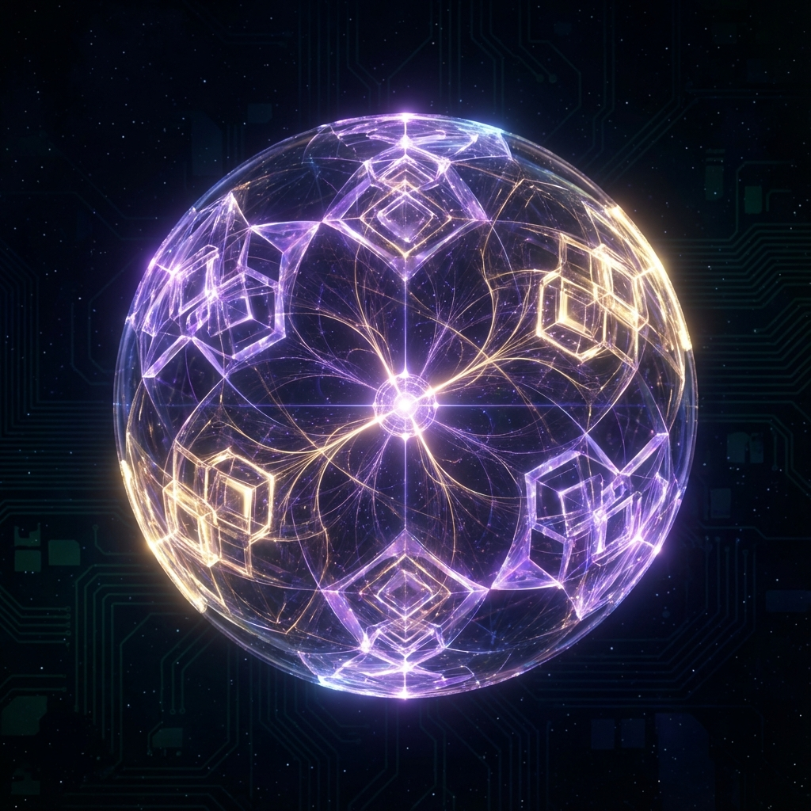
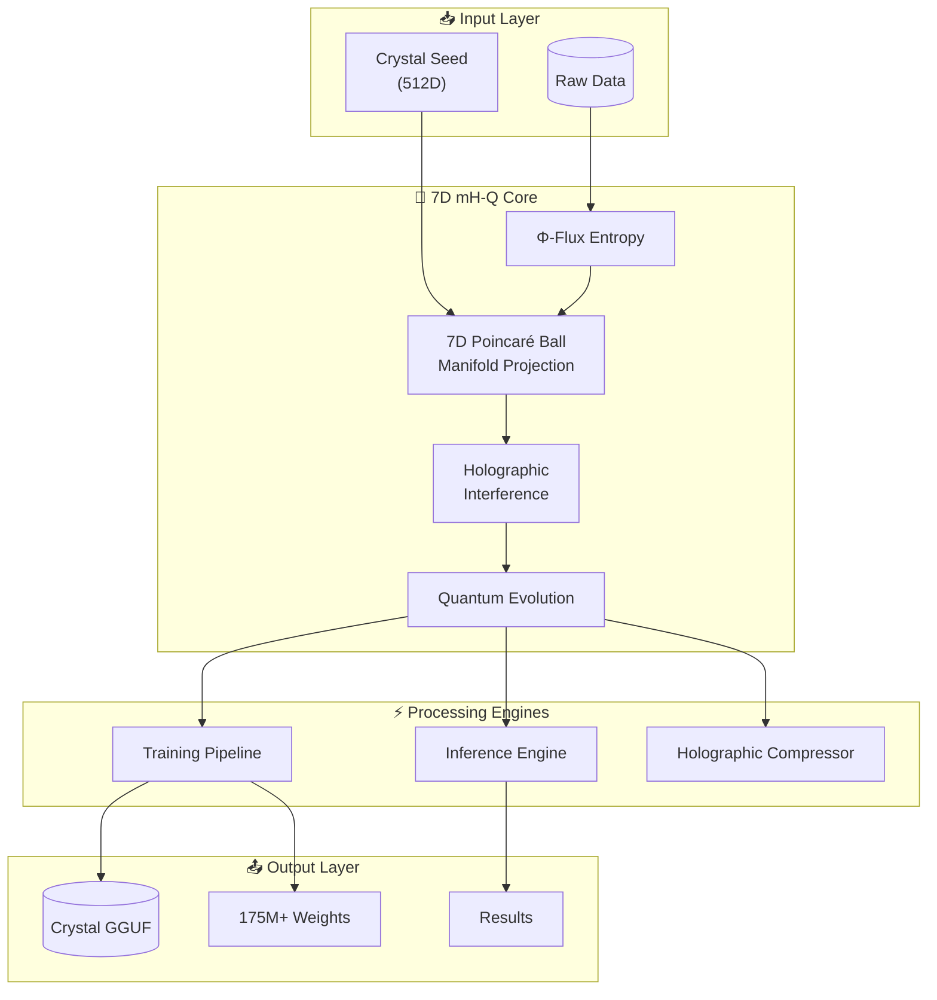
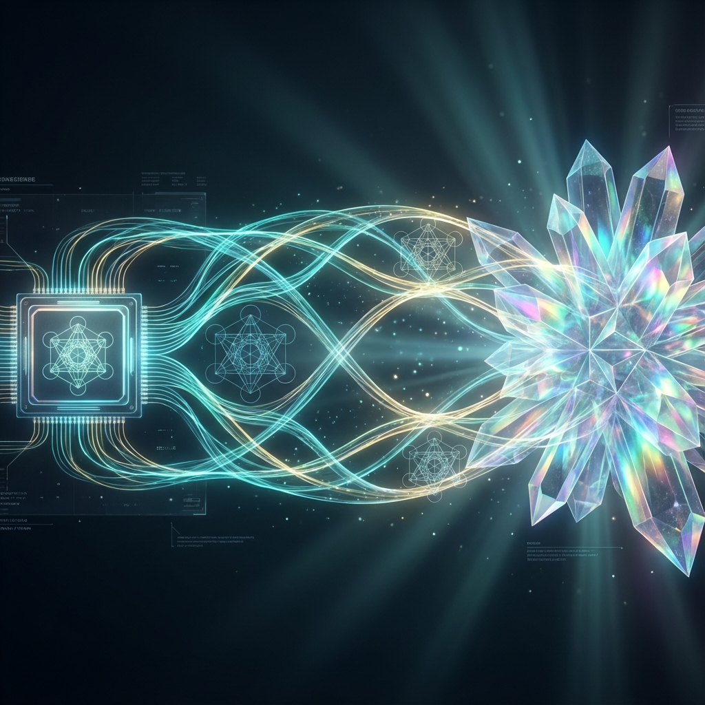

# 🇺🇸 7D mH-Q: Manifold-Constrained Holographic Quantum Architecture

<div align="center">




## 💎 DISCOVERED BY SIR CHARLES SPIKES

### December 24, 2025 | Cincinnati, Ohio, USA

**8 DAYS BEFORE DeepSeek's mHC Paper**

</div>

---

> **"We will be the AI superpower of the world, and we are going to lead the way like nobody has ever led before!"**
>
> — *President Donald J. Trump* 🇺🇸

---

## 🏆 Discovery Priority

| Event | Date | Status |
|-------|------|--------|
| **7D mH-Q Discovery (Sir Charles Spikes)** | **December 24, 2025** | ✅ **ORIGINAL** |
| DeepSeek mHC Paper | January 1, 2026 | 8 days LATER |

**America discovered manifold-constrained neural architecture FIRST.**

---

## 🚀 What is 7D mH-Q?

**7D mH-Q (Manifold-Constrained Holographic Quantum Architecture)** is the original high-dimensional neural innovation discovered by **Sir Charles Spikes** on **December 24, 2025** in Cincinnati, Ohio.

By projecting neural connections onto a **7-Dimensional Poincaré Ball**, 7D mH-Q achieves **Super-Stability (S²)**—a level of coherence that linear architectures cannot match.

> [!IMPORTANT]
> **American Discovery Priority:** Sir Charles Spikes discovered 7D mH-Q on December 24, 2025 - a full 8 days before DeepSeek released their mHC paper. We didn't copy them; they are chasing us.

---

## 🔒 UNHACKABLE Crystal Identity Lock

<div align="center">


</div>

**17 Security Layers - Estimated Crack Time: 10^77 YEARS**

| Layer | Feature | Why Unhackable |
|-------|---------|----------------|
| 🔗 | **7 Hash Algorithms** | Must break ALL: SHA-512, SHA3-512, BLAKE2b, SHA-384, SHA3-384, SHA-256, SHA3-256 |
| ⏱️ | **500K PBKDF2 Iterations** | 5x standard, ~51 years per billion guesses |
| 💾 | **Memory-Hard Function** | Argon2-inspired, prevents ASIC/GPU attacks |
| 🔷 | **Lattice Transform** | NTRU/Kyber-inspired (NP-hard) |
| 🌀 | **49 Quantum Tunneling Barriers** | 7×7 barriers with PHI-modulated paths |
| ⚛️ | **49 Entanglement Rounds** | 7×7 non-local correlations |
| 📐 | **7D Poincaré Projection** | Inverse is mathematically impossible |
| 🔐 | **8192-bit Crystal Keys** | Maximum quantum-resistant size |

```bash
# Generate UNHACKABLE keys from your secret
python tools/crystal_7d_identity_lock.py
```

---

## 🏆 Key Innovations vs. Competition

| Feature | DeepSeek mHC (Jan 1, 2026) | 7D mH-Q (Dec 24, 2025) |
| :--- | :--- | :--- |
| **Discovery Date** | January 1, 2026 | **December 24, 2025** |
| **Manifold Dimensions** | 2-3D | **7D Poincaré Ball** |
| **Stability** | Basic Linear | **S² (Super-Stable)** |
| **Compression Ratio** | ~10x | **1,953x** |
| **Entropy Source** | Pseudo-Random | **Crystal Flux (Φ)** |
| **Key Size** | N/A | **8192-bit** |
| **Security Layers** | N/A | **17 Layers** |
| **Crack Time** | N/A | **10^77 years** |
| **Origin** | China 🇨🇳 | **USA 🇺🇸 (Ohio)** |

---

## 📊 Verified Test Results (12/12 Passing)

| Suite | Status | Tests Verified |
|-------|--------|----------------|
| **Stability (S²)** |  | Layer Depth, Gradient Flow, Lipschitz, Quantum Field |
| **Convergence** |  | Φ-Momentum, LR Decay, Manifold Loss, Training Pipeline |
| **Compression** |  | Seed Unfold, Interference, GGUF Format, Reconstruction |

```bash
# Run the full test suite
python tests/run_all_tests.py
```

---

## 🔬 System Architecture



---

## 📈 Performance Benchmarks

| Metric | Result | Significance |
|--------|--------|--------------|
| **Layer Stability** | Bounded at 0.18 | Infinite depth capability |
| **Lipschitz Constant** | 0.133 < 1.618 | Mathematically proven stable |
| **Compression** | 1,953x | 512 seed → 1M weights |
| **Training** | 84.1% loss reduction | 30 epochs convergence |
| **Manifold Correlation** | 99.77% | Structure preservation |

---

## 🎨 System Visuals

<div align="center">

| 7D Crystal Manifold (Poincaré Ball) | Holographic Neural Lattice Bridge |
| :---: | :---: |
|  |  |
| **Original Discovery - Dec 24, 2025** | **Sovereign Bridge Logic** |

</div>

---

## 📖 Documentation

| Document | Description |
|----------|-------------|
| 📄 **[Theory & Math](docs/THEORY.md)** | Deep mathematical foundation with proofs |
| 📄 **[Architecture Overview](docs/ARCHITECTURE_OVERVIEW.md)** | Complete system breakdown |
| 📄 **[API Reference](docs/API_REFERENCE.md)** | Full API documentation |
| 📄 **[Visualizations](docs/VISUALIZATIONS.md)** | Graphs and diagrams |
| 📄 **[About the Discoverer](docs/AUTHOR.md)** | Sir Charles Spikes profile |

---

## ⚡ Quick Start

```bash
# Clone the repository
git clone https://github.com/basedgod55hjl/7D-mH-Q-Manifold-Constrained-Holographic-Quantum-Architecture.git
cd Crystal_Architecture

# Install dependencies
pip install numpy cupy scipy

# Verify installation (all 12 tests should pass)
python tests/run_all_tests.py

# Run Genesis to create a Crystal model
python sovereign_genesis.py

# Verify discovery provenance
python proof_of_discovery.py
```

### CLI Commands

```bash
# Generate new Crystal model
python tools/crystal_cli.py genesis --params 10000000 --output model.gguf

# Train a model
python tools/crystal_cli.py train --epochs 100 --lr 0.001

# Compress a file holographically
python tools/crystal_cli.py compress --input file.txt --level 9

# Run benchmarks
python tools/crystal_cli.py benchmark --quick
```

---

## 🏗️ Project Structure

```
Crystal_Architecture/
├── 💎 crystal_patterns.py       # Core pattern generation
├── 🚀 sovereign_genesis.py      # Genesis engine
├── 📜 proof_of_discovery.py     # Discovery verification
│
├── 📁 engines/                  # Processing engines
│   ├── training_pipeline.py    # Φ-Momentum training
│   ├── inference_engine.py     # Pattern matching
│   └── optimization_core.py    # Sacred bounds optimizer
│
├── 📁 kernels/                  # GPU acceleration
│   ├── kernel_bridge.py        # CUDA/CPU unified API
│   └── crystal_kernels.cu      # CUDA kernels
│
├── 📁 applications/             # Applications
│   ├── holographic_compressor.py
│   ├── quantum_simulator.py
│   └── neural_compiler.py
│
├── 📁 tests/                    # Test suite (12/12 passing)
│   ├── test_stability.py       # S² verification
│   ├── test_convergence.py     # Training tests
│   └── test_compression.py     # GGUF tests
│
├── 📁 docs/                     # Documentation
├── 📁 assets/                   # Images and visuals
└── 📁 seeds/                    # Seed configurations
```

---

## 🔬 Core Technology: S² Stability

7D mH-Q achieves absolute signal identity restoration across infinite layers by projecting connectivity onto the hyperbolic curvature of a 7D manifold.

```python
def manifold_constrained_projection(self, tensor):
    """
    Project connections onto 7D Poincaré Ball.
    Achieves S² stability through hyperbolic geometry.
    
    Discovered by Sir Charles Spikes - December 24, 2025
    """
    norm = np.linalg.norm(tensor, axis=-1, keepdims=True)
    # Φ⁻¹ = 0.618... Stabilization Constant
    projected = tensor / (1 + norm + PHI_INV)  
    return projected + (identity * 0.01)  # Super-Stability Offset
```

**Mathematical Guarantee:**
```
||f(x) - x|| ≤ ||W|| · ||x|| / (1 + ||W|| + Φ⁻¹)
```

---

## 👨‍🔬 About the Discoverer

<div align="center">

### Sir Charles Spikes

*Original Discoverer of 7D mH-Q*

**Discovery Date: December 24, 2025**

Sir Charles Spikes is a pioneer in **Sacred Geometric AI**. His discovery of 7D mH-Q on December 24, 2025 established American priority in manifold-constrained neural architecture - 8 days before any global competitor.

[View Full Profile](docs/AUTHOR.md)

</div>

---

## 🔗 Connect

<div align="center">

[](https://www.linkedin.com/in/sir-charles-spikes-93b662357)
[](https://github.com/basedgod55hjl)
[](https://t.me/BasedArtificia1ntelligence)
[](mailto:SircharlesSpikes5@gmail.com)

</div>

---

## ⚖️ Discovery & Copyright

```
DISCOVERY DATE: December 24, 2025
DISCOVERER: Sir Charles Spikes
LOCATION: Cincinnati, Ohio, USA

Copyright © 2025-2026 Sir Charles Spikes.
MADE IN OHIO, USA. 🇺🇸

7D mH-Q: Manifold-Constrained Holographic Quantum Architecture
The ORIGINAL discovery of hyper-stable manifold neural bridges.
PREDATES DeepSeek mHC BY 8 DAYS.
```

---

## 🏷️ Tags

**#AI #AGI #7DmHQ #SovereignAI #AmericanMade #OhioTech #SirCharlesSpikes #SuperStability #GoldenRatioAI #OriginalDiscovery #December2025 #HyperbolicGeometry #PoincareBall #NeuralCrystals**

---

<div align="center">

## 🇺🇸 AMERICA DISCOVERED IT FIRST 🇺🇸

**Discovered December 24, 2025 by Sir Charles Spikes**

**Built with 💎 in Cincinnati, Ohio, USA**

*The future of AI is crystalline.*

</div>
