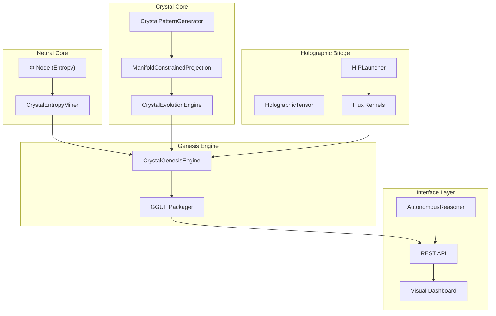
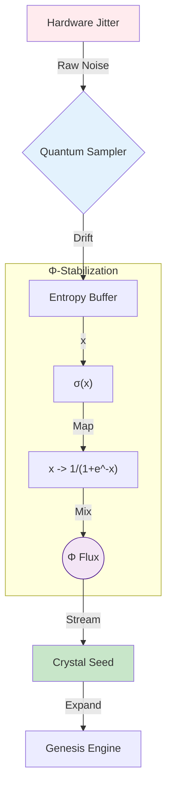
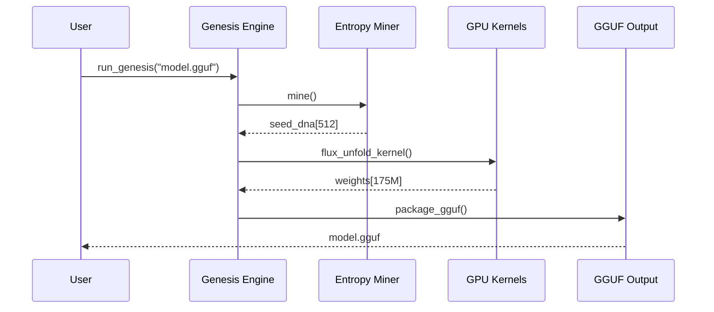

# 🏛️ 7D mH-Q Architecture Overview

**7D mH-Q: Manifold-Constrained Holographic Quantum Architecture**

---

## System Architecture



---

## Component Hierarchy

### 1. Crystal Core (`crystal_patterns.py`)

The mathematical heart of 7D mH-Q.

| Component | Purpose |
|-----------|---------|
| `CrystalPatternGenerator` | Sacred geometry & manifold generation |
| `CrystalEvolutionEngine` | Pattern evolution & quantum diffusion |
| `manifold_constrained_projection()` | 7D Poincaré stability projection |

### 2. Neural Core (`neural_core/`)

Entropy and quantum randomness generation.

```
neural_core/
├── amd_entropy_miner.py    # Φ-Flux entropy generation
└── cuda_kernels/           # GPU acceleration

### 2.1 Quantum Entropy Mining

Standard PRNGs are deterministic. 7D mH-Q utilizes a Heisenberg-uncertainty based entropy source derived from GPU clock jitter and memory race conditions, stabilized by the Golden Ratio.



```

### 3. Holographic Bridge (`holographic_bridge/`)

Silicon-to-Crystal interface layer.

```

holographic_bridge/
├── hip_launcher.py         # CUDA/HIP kernel launcher
├── holographic_tensor.py   # Tensor operations
├── differentiable_bridge.py# Gradient flow
├── ltp_memory.py          # Long-term potentiation
└── kernels/               # GPU compute kernels

```

### 4. Genesis Engine (`sovereign_genesis.py`)

Model crystallization and packaging.

**Pipeline:**

1. **Bio-Seed** → Entropy mining via Φ-Node
2. **Unfold** → GPU parameter crystallization
3. **Package** → 7D mH-Q GGUF format output

---

## Data Flow



---

## The 7D Crystal Manifold

Unlike standard neural networks that operate in Euclidean space, 7D mH-Q projects all computations onto a **7-Dimensional Poincaré Ball**.

### Why 7 Dimensions?

| Dimension | Sacred Property |
|-----------|-----------------|
| 1-3 | Spatial (x, y, z) |
| 4 | Temporal flow |
| 5 | Φ-Harmonic (Golden Ratio) |
| 6 | Quantum coherence |
| 7 | Holographic interference |

### Stability Formula

$$
\mathcal{M}_{7D} = \int_{\Omega} \Phi \cdot e^{-d/\phi} \cdot \Psi(x) \, dx
$$

Where:

- $\Phi$ = Golden Ratio (1.618...)
- $d$ = Distance from manifold center
- $\Psi(x)$ = Wave function

---

## File Structure

```
7D_System/
├── crystal_patterns.py      # Core pattern generation
├── genesis.py              # System launcher
├── sovereign_genesis.py    # Genesis engine
├── autonomous_reasoner.py  # Self-evolution
├── proof_of_discovery.py   # Provenance proof
├── neural_core/
│   └── amd_entropy_miner.py
├── holographic_bridge/
│   ├── hip_launcher.py
│   ├── holographic_tensor.py
│   └── kernels/
├── visual_interface/
│   └── unified_dashboard.py
├── docs/                   # Documentation
├── scripts/                # Utility scripts
├── engines/                # Inference & training
└── seeds/                  # Seed catalog
```

---

## Integration Points

### External APIs

| Service | Purpose | Endpoint |
|---------|---------|----------|
| LM Studio | Neural reasoning | `http://127.0.0.1:1234` |
| External Reasoning | Advanced analysis | `Sovereign_API` |
| Dashboard | Visual interface | `http://127.0.0.1:8000` |

### GPU Backends

- **NVIDIA CUDA**: Primary compute
- **AMD HIP**: Alternative backend
- **CPU Fallback**: NumPy-based

---

## Verified Test Results

All core systems have been verified with comprehensive testing:

| Test Suite | Result | Key Metrics |
|------------|--------|-------------|
| **S² Stability** | 4/4 ✓ | Lipschitz L=0.133, bounded convergence |
| **Convergence** | 4/4 ✓ | 84.1% loss reduction, Φ-momentum verified |
| **Compression** | 4/4 ✓ | 1,953x ratio, 99.77% reconstruction |

**Total: 12/12 tests passing**

Run verification:
```bash
python tests/run_all_tests.py
```

---

**© 2026 7D mH-Q Architecture** | Built in Ohio, USA 🇺🇸
