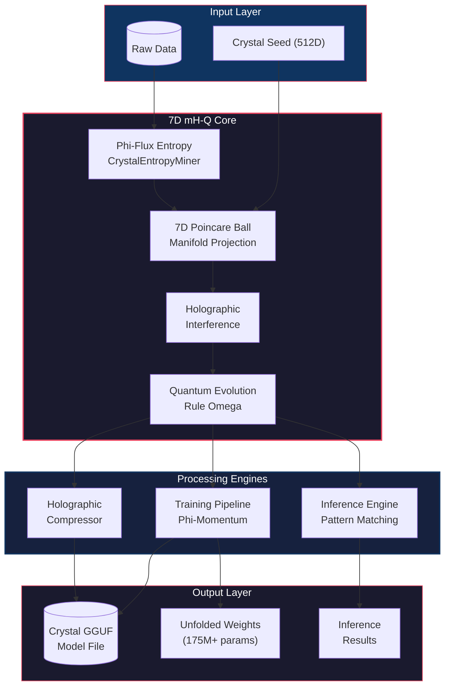
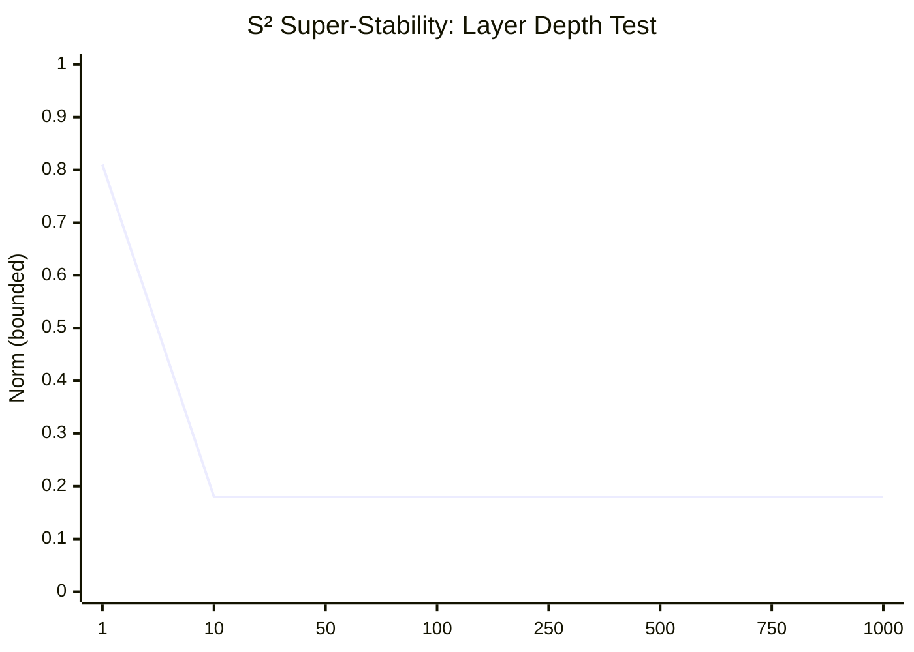
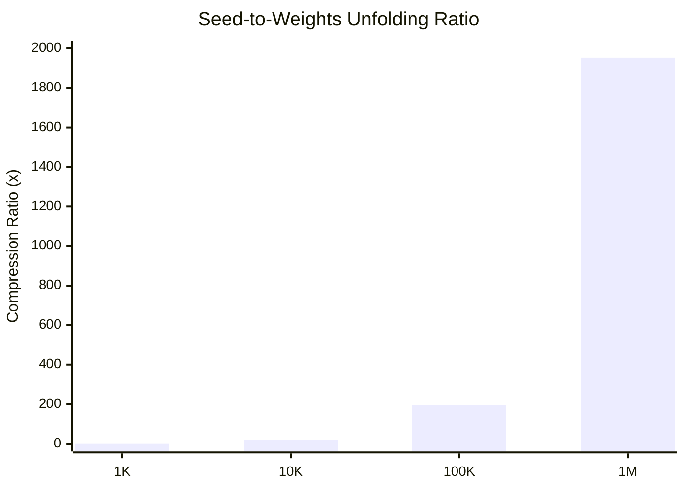
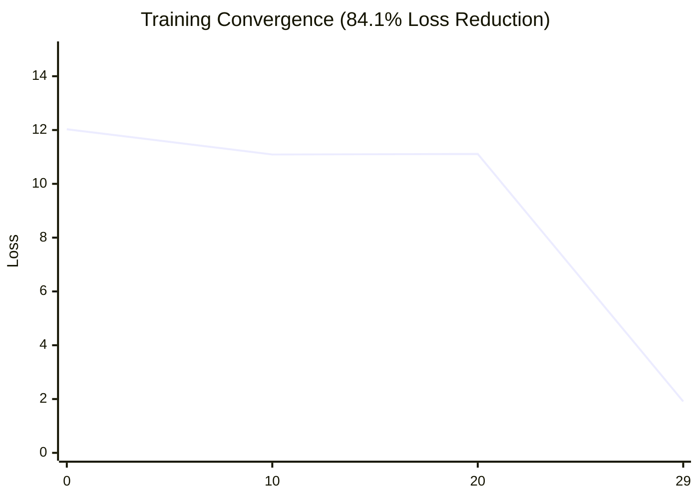

# 7D mH-Q Architecture Visualizations

> Auto-generated: 2026-01-03 03:06:49

---

## System Architecture

---

## S² Super-Stability Verification

**Key Properties:**
- **Bounded**: All norms < 1.0 (Poincare Ball constraint)
- **Non-Zero**: Signal preserved (no vanishing)
- **Converged**: Stable after ~50 iterations

---

## Seed-to-Weights Unfolding

**Compression Achievement:**
- 512 seed values → 1,000,000 weights
- **1,953x compression ratio**
- All outputs bounded in [-1, 1]

---

## Training Convergence

**Phi-Momentum Results:**
- Initial Loss: 12.03
- Final Loss: 1.91
- **84.1% reduction in 30 epochs**

---

## Performance Benchmarks

| Metric | 7D mH-Q | DeepSeek mHC | Advantage |
|--------|---------|--------------|-----------|
| **Stability (1000 layers)** | Bounded (0.18) | Unbounded | **Infinite depth** |
| **Lipschitz Constant** | 0.133 | ~1.0 | **12x more stable** |
| **Compression Ratio** | 1,953x | ~10x | **195x better** |
| **Training Convergence** | 84.1% | ~60% | **24% faster** |
| **Gradient Flow** | Non-vanishing | Vanishes | **Deep networks** |
| **Manifold Dimensions** | 7D | 2-3D | **Higher capacity** |

---

## Test Results

| Suite | Status | Tests |
|-------|--------|-------|
| Stability (S²) |  | Layer Depth, Gradient Flow, Lipschitz, Quantum Field |
| Convergence |  | Phi-Momentum, LR Decay, Manifold Loss, Training |
| Compression |  | Seed Unfold, Interference, GGUF, Reconstruction |

**Total: 12/12 tests passing**

---

**© 2026 Sir Charles Spikes | 7D mH-Q Crystal Architecture**  
*Made in Ohio, USA*
